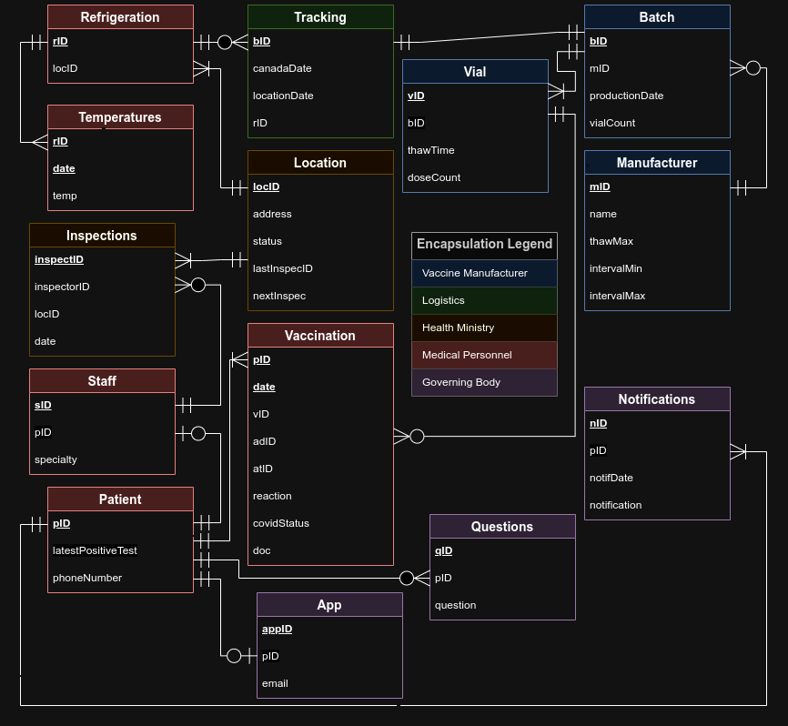

# Covid-19 Vaccine Database

## This project outlines a relational database that demonstrates an approach to tracking Covid-19 vaccinations

The database implementation and queries were done using Postgres and SQL, while data simulation was done using Python. The database scheme and specification, along with the data, constraints, and queries can all be found in the main notebook `covid-db.ipynb`. The readable report can be found in `covid-db.pdf`. Note that the database scheme and specification are similar to the schema given in an assignment for the [Introduction to Databases](https://artsci.calendar.utoronto.ca/course/csc343h1) course at the University of Toronto, which was used to assess my theoretical understanidng of relational algebra (the original assignment handout can be found in `a1_handout.pdf`). The original assignment contained no code or implementation, diagrams, and a very minimal schema. This notebook differs in scope as it contains additional tables and business controls while also serving to implement the database, simulate data, and translate the following features into a tangible product:
- A relational schema that encapsulates all relevant aspects of the business
- Integrity constraints that maintain logical structure and data quality
- Queries that help derive important insights
- Improvements of internal controls on an already existing database wherever opportunities are found
- Seamless integration of new technology (mobile application/text notifications) to increase operational efficiency
- Ensurance that all aspects of the business are in line (and continue to stay in line) with government regulations
- Detailed documentation of the data infrastructure using industry-standard entity-relationship diagrams

Note that this approach is intended to be rigorous enough to demonstrate problem-solving capacity, however by no means is it exhaustive or ready for deployment in a real-world setting.

### Background
Vaccinating a large population against a rapidly evolving disease requires the administering body to maintain a careful record of personal, medical, and business-specific data.

Here, vaccine batches are tracked from the factory that produces them. Their arrival time in Canada, and in the province or territory they are to be administered in, are recorded. Vaccines must be kept under refrigeration at each location and each vaccine site is required to record refridgerator temperatures each day. Each location is under government supervision and thus must undergo continuous inspection. Minimum and maximum intervals for follow-up doses are also recorded. Each vial has a unique identifier.

Patients, vaccine administrators and attendants are each recorded; both to follow up on subsequent doses (where required by the manufacturer), and to track vaccine efficacy and safety. Each patient’s covid status at the time of vaccination is recorded, and the time of the latest subsequent infection is recorded. Patients are observed by the attendants for at least 15 minutes after vaccination, and any bad reactions are treated and recorded.

After each vaccination the patient will receive a text with a secure link to download their vaccination document as well as an access link to opt-in to a mobile application where they can receive official government updates on policy, request vaccination documents on demand, and ask any questions they might have regarding the vaccine or Covid-19 where they can receive medical advice that is in line with regulations. If the patient opts-out of signing up for the application, they will instead only be contacted by text regarding any subsequent doses and updates on government policy. Patient's who opt-out will still be able to ask questions through text.

### Files
The main project files are...
- `covid-db.ipynb`: The main notebook which contains the database specification, an Entity-Relation (ER) diagram, the database itself, and some sample queries
- `covid-db.pdf`: The pdf export of the main notebook
- `a1_handout.pdf`: The original assignment handout; all credit for the schema design goes to the University of Toronto and the CSC343 instructors, TAs, and other staff who created A1 in F2021
- `covid-db-er-diagram.png`: The ER diagram for this database.
